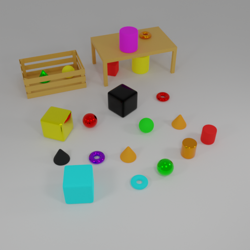

# AOVR-Dataset

## Annotated Objects for Visual Reasoning Dataset

The AOVR-Dataset is a synthetic 3D dataset designed to facilitate research in visual reasoning and object detection. The dataset includes various 3D objects placed in different containers, each annotated with bounding boxes and natural language descriptions. The 3D models were created using Blender, and the captions were generated with a Large Language Model (LLM).

The AOVR-Dataset aims to support research and development in the fields of computer vision and artificial intelligence, particularly focusing on tasks that require visual reasoning, object detection, and natural language understanding.

## Dataset Description

### Objects

The dataset includes a variety of objects with different attributes:

- **Shapes**: Cylinder, Cube, Torus, Cone, Sphere
- **Colors**: Blue, Magenta, Black, Red, Orange, Purple, Green, Yellow, Cyan
- **Materials**: Metal, Rubber
- **Containers**: Floor, Shelf bottom, Shelf top, Table top, Table under, Crate, Box
- **Sizes**: Small, Big

### Annotations

Each object is annotated with:
- Bounding boxes
- Natural language descriptions
